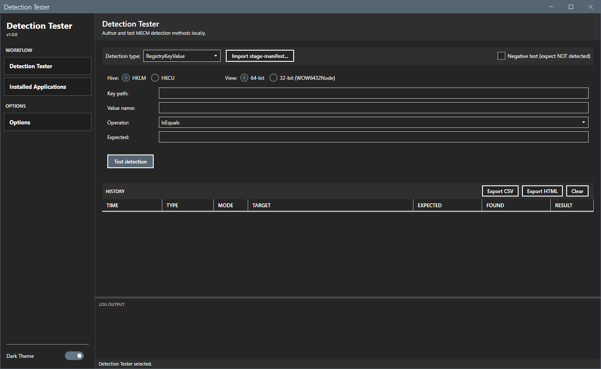

# Detection Method Tester

Test MECM application detection methods against the local machine without deploying through MECM.

## What It Does

MECM application packagers define detection methods (registry key checks, file existence/version, scripts) that determine whether an application is installed. A broken detection rule means a failed deployment and a round-trip to fix it. This tool authors and tests detection logic locally and gives immediate pass/fail results.



## Detection Types

| Type | What It Checks |
|---|---|
| **RegistryKeyValue** | Opens a registry key (HKLM or HKCU), reads a value, compares with operator (IsEquals, GreaterEquals, etc.) |
| **RegistryKey** | Checks if a registry key exists (HKLM or HKCU) |
| **File** | Checks file existence, optionally compares file version |
| **Script** | Executes a PowerShell scriptblock; any non-empty stdout = detected |
| **Compound** | Evaluates multiple clauses with And/Or logic (import-only) |

## Modules

The shell has two modules accessible from the sidebar:

### Detection Tester

Author and test detection clauses. Pick a type, fill in the parameters, click **Test detection**. Results appear in a Pass/Fail badge with details. Every test is logged to the history grid below.

- **Hive selector** — HKLM or HKCU on registry types. HKCU covers per-user installs (Adobe Reader DC, Chrome user-mode, OneDrive).
- **View selector** — explicit 64-bit / 32-bit (WOW6432Node) for registry keys, removing the "why did my clause fail" ambiguity around architecture-split paths.
- **Negative test mode** — flip pass/fail logic so "not detected" is a passing test. Useful for verifying that an uninstall removed the ARP entry.
- **Import stage-manifest** — load a `stage-manifest.json` from Application Packager and auto-populate the fields. Compound detections come in as a read-only clause list with a connector (And/Or).
- **Use selected** — clicking a history row repopulates the input panel, so you can re-run a clause after the original ARP entry has been uninstalled.
- **Export CSV / Export HTML** — write the history to a self-contained report under `%LOCALAPPDATA%\DetectionTester\reports\`.

### Installed Applications

Browse all installed applications from both ARP registry hives (HKLM x64, HKLM WOW6432Node, HKCU). Filter by name, scope by Machine / User. Double-click or click **Use for detection** to switch to the Detection Tester module with the registry key and version pre-filled.

Select any application to see full ARP details: DisplayName, Publisher, DisplayVersion, Architecture, Scope, RegistryKey, UninstallString, QuietUninstallString, InstallLocation, InstallDate. Click **Copy details** to copy all fields to clipboard.

## Prerequisites

| Requirement | Details |
|---|---|
| **OS** | Windows 10/11 or Windows Server 2016+ |
| **PowerShell** | 5.1 (ships with Windows) |
| **.NET Framework** | 4.7.2+ (required by WPF + MahApps.Metro) |

No admin rights and no MECM connection required.

## Usage

1. Extract the release zip and open the folder.
2. Launch the GUI:
   ```powershell
   .\start-detectiontester.ps1
   ```
3. Pick a detection type, fill in parameters, click **Test detection**.

The Options dialog (sidebar → Options) shows the log path and a button to open the per-app data folder under `%LOCALAPPDATA%\DetectionTester\`.

## License

MIT.
