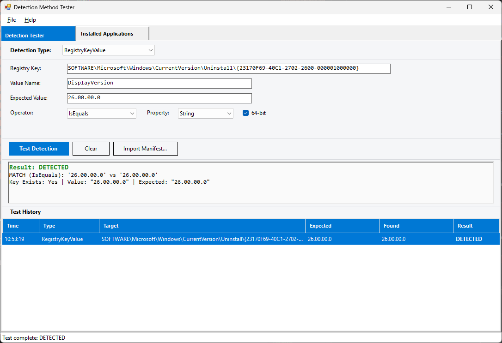

# Detection Method Tester

Test MECM application detection methods against the local machine without deploying through MECM.

## What It Does

MECM application packagers define detection methods (registry key checks, file existence/version, scripts) that determine whether an application is installed. A broken detection rule means a failed deployment and a round-trip to fix it. This tool tests detection logic locally and gives immediate pass/fail results.

## Screenshot



## Detection Types

| Type | What It Checks |
|---|---|
| **RegistryKeyValue** | Opens HKLM registry key, reads a value, compares with operator (IsEquals, GreaterEquals, etc.) |
| **RegistryKey** | Checks if an HKLM registry key exists |
| **File** | Checks file existence, optionally compares file version |
| **Script** | Executes a PowerShell scriptblock; any non-empty stdout = detected |
| **Compound** | Evaluates multiple clauses with And/Or logic (import-only) |

## Tabs

### Detection Tester

Select a detection type, fill in the parameters, and click **Test Detection**. The results panel shows DETECTED/NOT DETECTED with details (key exists, value found, version comparison). Each test is logged to the history grid below.

- **Import Manifest** loads a `stage-manifest.json` from Application Packager and auto-populates the fields
- Right-click the history grid to **Copy**, **Export CSV**, or **Export HTML**

### Installed Applications

Enumerates all installed applications from both ARP registry hives (x64 + WOW6432Node). Filter by name, then double-click or click **Use for Detection** to switch to the Detection Tester tab with the registry key and version pre-filled.

## Prerequisites

| Requirement | Details |
|---|---|
| **OS** | Windows 10/11 or Windows Server 2016+ |
| **PowerShell** | 5.1 (ships with Windows) |
| **.NET Framework** | 4.8+ (required by WinForms GUI) |

No admin rights and no MECM connection required.

## Usage

1. Open PowerShell and navigate to the project directory.

2. Launch the GUI:
   ```powershell
   .\start-detectiontester.ps1
   ```

3. Select a detection type, enter parameters, and click **Test Detection**.

4. Or switch to the **Installed Applications** tab, find an app, and click **Use for Detection**.

## License

MIT
